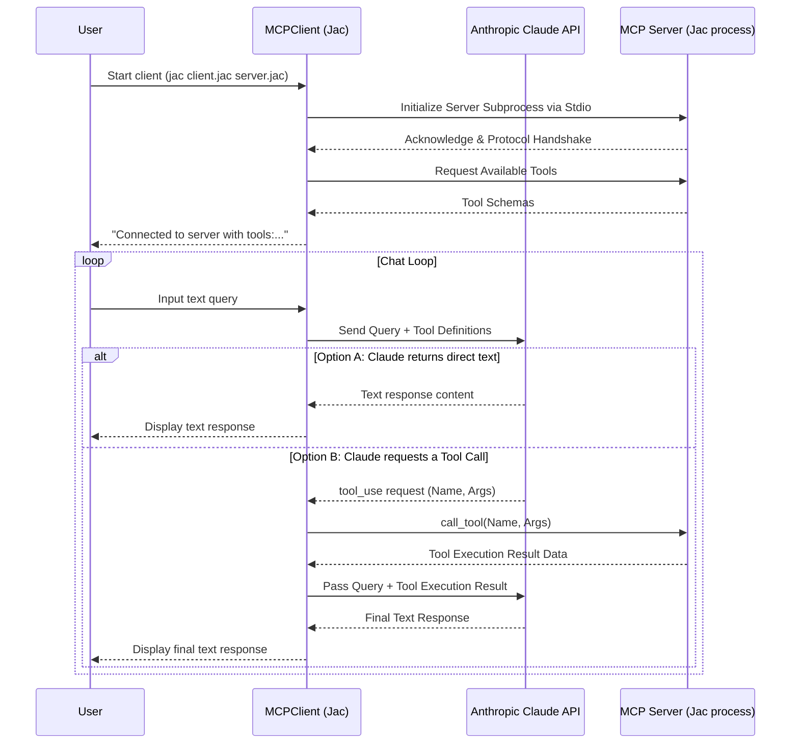
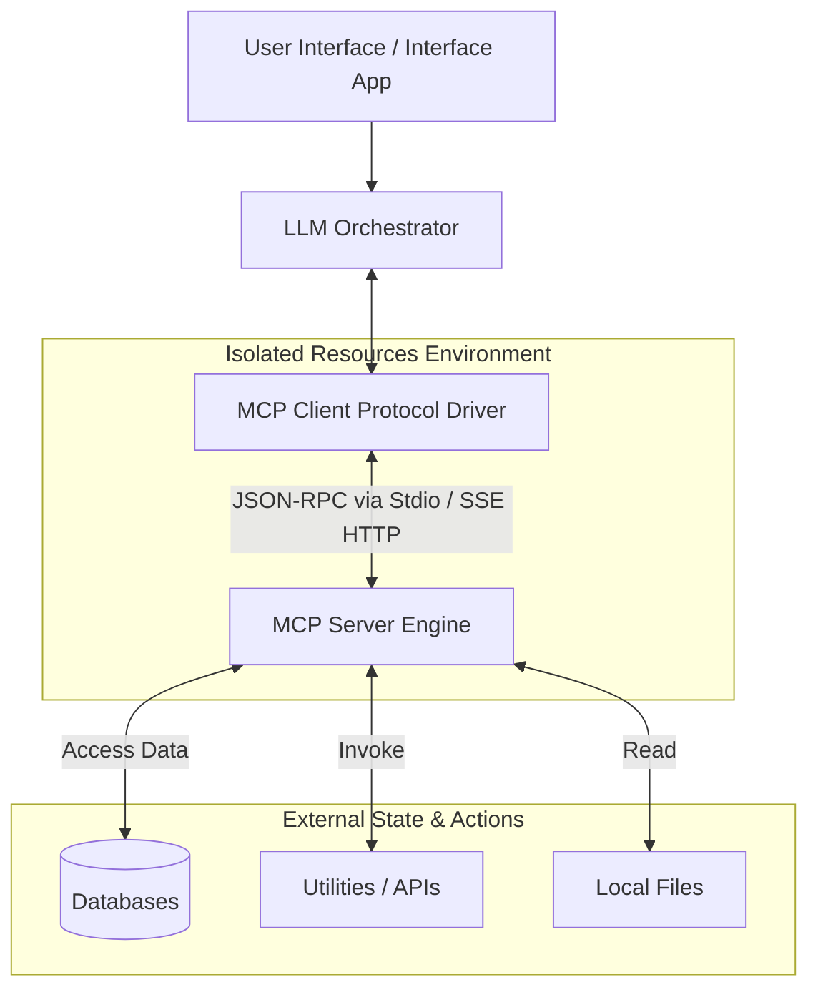

# MCP Client Architecture and Code Analysis

This document provides a detailed breakdown of the `mcp_client.jac` script, its architecture, and the generalized Model Context Protocol (MCP) Client architecture.

## 1. Line-by-Line Code Explanation

### Imports and Setup
- **Lines 1-2**: `import asyncio; import sys;` - Imports standard Python asynchronous I/O and system modules.
- **Lines 3-4**: `import from typing { Optional }`, `import from contextlib { AsyncExitStack }` - Imports for type hinting and managing asynchronous context managers.
- **Lines 6-7**: `import from mcp { ClientSession, StdioServerParameters }`, `import from mcp.client.stdio { stdio_client }` - Core components for connection (via stdio) and session handling with the MCP Server.
- **Lines 9-10**: `import from anthropic { Anthropic }`, `import from dotenv { load_dotenv }` - Imports the Anthropic SDK to use Claude and dotenv to load environment variables (like API keys).
- **Lines 12-14**: `with entry { ... }` - Executes `load_dotenv()` when the script runs to ensure environment variables are loaded from a `.env` file before executing anything else.

### MCPClient Object Definition
- **Line 16**: `obj MCPClient {` - Defines the main client object encapsulating all logic.
- **Lines 17-19**: `has session...; has exit_stack...; has anthropic...;` - Initializes properties: the MCP session state, context manager stack (for clean asynchronous teardowns), and the Anthropic API client interface.async def cleanup(){
            """Clean up resources""";
            await self.exit_stack.aclose();
        }async def cleanup(){
            """Clean up resources""";
            await self.exit_stack.aclose();
        }

### Connection Method
- **Line 22**: `async def connect_to_server(server_script_path: str) {` - Asynchronous method to initiate the server connection.
- **Lines 28-32**: Validates that the provided server script ends with `.jac`. Sets the command to run the script using the `jac` executable.
- **Lines 33-37**: `server_params = StdioServerParameters(...)` - Configures the parameters to start the external MCP server process via standard I/O streams using the provided script path.
- **Line 39**: `stdio_transport = await self.exit_stack.enter_async_context(stdio_client(server_params));` - Spawns the subprocess server over stdio and ensures proper cleanup context.
- **Line 40**: `(self.stdio, self.write) = stdio_transport;` - Extracts the read and write streams from the transport mechanism.
- **Line 41**: `self.session = await self.exit_stack.enter_async_context(ClientSession(self.stdio, self.write));` - Establishes the MCP Client Session over these standard I/O streams.
- **Line 43**: `await self.session.initialize();` - Initializes the session protocol handshake between the client and server.
- **Lines 45-48**: Retrieves the available tools from the server via `await self.session.list_tools()` and prints their names to confirm a successful connection and sync.

### Query Processing Method
- **Line 52**: `async def process_query(query: str) -> str {` - Handles processing of a user's typed prompt.
- **Lines 54-59**: Formats the user's `query` into a message dictionary list suitable for the Anthropic Messages API.
- **Lines 61-66**: Fetches available tools from the MCP server again and formats them into JSON schemas compatible with Claude's function-calling tool format.
- **Lines 69-74**: Makes the initial API call to Anthropic's `claude-sonnet` model, passing the query and the available tool schemas.
- **Line 77**: `final_text = [];` - Initializes a list to accumulate text response strings.
- **Lines 80-117**: Iterates over the items returned by Claude in its response contents.
  - **81-84**: If the returned content is plain `text`, appends it to `final_text` and to the running message history.
  - **85-116**: If the content asks for a `tool_use`:
    - Retrieves the `tool_name` and `tool_args`.
    - **90**: `result = await self.session.call_tool(tool_name, tool_args);` - Dispatches the tool execution request over RPC to the connected MCP server.
    - **94-107**: Appends the assistant's action intention and the tool's actual result to the message block, adhering strictly to Anthropic's required API history format.
    - **110-114**: Calls the Claude API again, passing back the tool's result (though it seems `messages=messages` is accidentally missing in line 113 of the source code here, which is meant to pass the context back) so the LLM can generate a final answer based on the tool's output.
- **Line 118**: Returns the concatenated plain text from the entire interaction cycle.

### Interactive Chat Loop & Cleanup
- **Lines 122-141**: `async def chat_loop()` - Infinite loop accepting user input via `input("\nQuery: ")`. Breaks the loop if the user types 'quit'. Otherwise, calls `process_query` and prints the output result. Includes a broad block to catch and print exceptions gracefully.
- **Lines 143-146**: `async def cleanup()` - Simply calls `aclose()` on the `AsyncExitStack` to safely terminate the session and close the underlying process standard I/O streams.

### Main Execution
- **Lines 152-165**: `async def main()` - The primary async entry point. Validates command-line arguments (ensuring the server script path is provided manually), instantiates `MCPClient()`, connects to the server, loops the chat, and ensures `cleanup` is universally called in a `finally` block before exiting.
- **Lines 167-170**: `with entry { ... asyncio.run(main()); }` - Standard Jac entry block that imports `sys` again locally and starts the top-level asyncio event loop.

---

## 2. Overall Architecture Diagrams

### System Interaction Diagram
This diagram illustrates how the components in `mcp_client.jac` run and pass information back and forth between the user, the LLM, and the subprocess Server.

---

## 3. Main Components of the Script

1. **ClientSession & Stdio Transport Module**: Handles low-level communication (the base protocol layer). Specifically utilizes standard input/output (stdio) to spawn and talk to a local MCP server process in an isolated manner.
2. **LLM Orchestration (Anthropic SDK)**: Acts as the reasoning engine for the application logic. It decides dynamically whether to answer the user directly out-of-the-box or delegate logic to one of the tools exposed by the MCP Server.
3. **The Tool Execution Router (`process_query`)**: The nexus point mapping capabilities exposed by the MCP Server directly to the orchestration engine. It translates server tools into Claude-compatible JSON schema configurations, catches tool fulfillment needs, triggers execution on the local server, and passes the output to Claude.
4. **Chat Interface & Resource Manager**: An interactive terminal UI paired closely with an `AsyncExitStack` context manager that maintains and tears down background processes gracefully so no zombie node/python processes remain hanging on exit.

---

## 4. Generalized Architecture of an MCP Client

The Model Context Protocol (MCP) aims to standardize how AI applications dynamically discover and access external context, data sources, and actions. 

### Key Elements of the Generalized Architecture:
1. **Host AI Application**: The application housing the client where interactions happen (e.g., Cursor, a chat terminal, voice app).
2. **LLM Orchestrator**: Uses function-calling schema logic to determine *if* and *when* an external action is requested.
3. **MCP Client Core Mechanism**: Acts entirely as an unopinionated bridge passing JSON-RPC messages. Rather than hard-coding knowledge of what APIs exist, it dynamically asks the MCP server for "Discoverable Features".
4. **MCP Server Mechanisms**: Exists strictly to fulfill requests in standard formats securely. Servers can expose three types of context:
    - **Resources**: State/Data formatted as file URIs.
    - **Prompts**: Standardized system templates and message presets.
    - **Tools**: Directly invokable arbitrary functions (what this specific `.jac` script focuses on).

By decoupling these modules natively, the LLM model never needs to be explicitly configured or hard-coded for a specific database implementation. The Client asks for schemas, relays them to the Model, and essentially just handles middle-layer routing to map standard AI tool-use into functional local RPC invocations.
